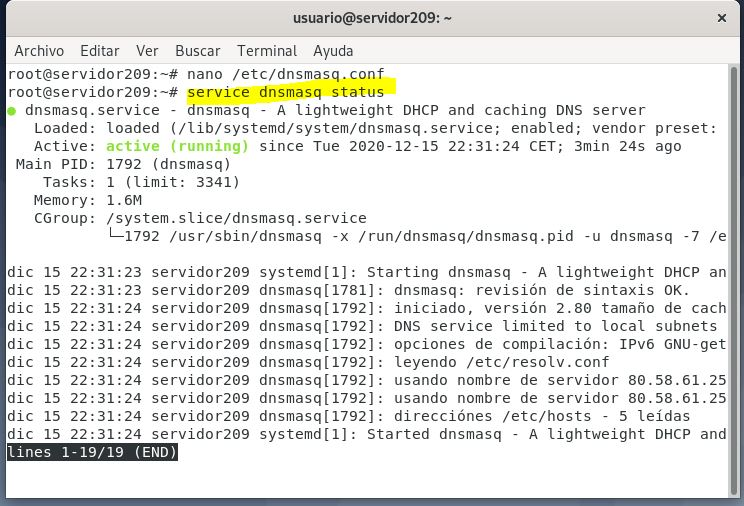
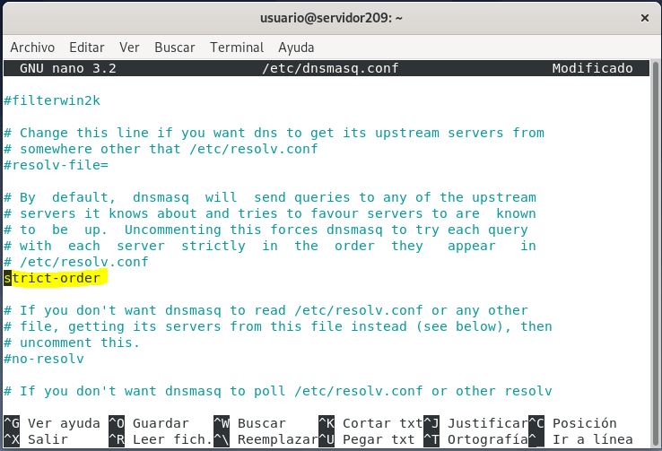
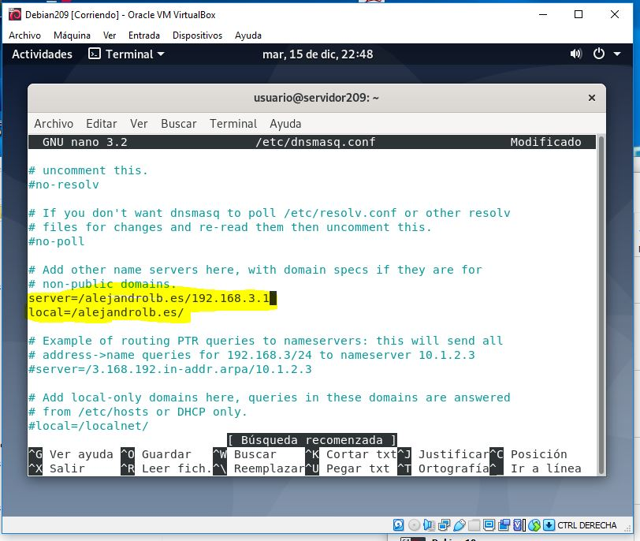
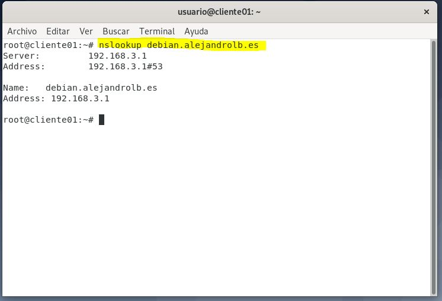

# DNSMASQ
## Introduccion
#### ¿ Que es DNSMASQ ?
DNSMASQ es un redireccionador de DNS ligero y fácil de configurar, diseñado para proporcionar servicios DNS a una red de pequeña escala. Puede servir los nombres de máquinas locales que no están en el DNS global.
#### ¿ En que consiste ?
DNSMASQ proporciona redireccionador de sistema de nombres de dominio (DNS), servidor de protocolo de configuración dinámica de host (DHCP), enrutador de publicidad y funciones de arranque de red para pequeñas redes informáticas, creado como software libre.
## Indice
1. [Instalación](#instalacion)
2. [Configuración](#configuracion)
3. [Pruebas](#pruebas)
<a name="instalacion"></a>
### 1. Instalación
Para la instalación de DNSMASQ solo necesitaremos un comando:
```
$ apt-get install -y dnsmasq resolvconf
```
A continuacion vamos a ver el estado de dnsmasq  
  
<a name="configuracion"></a>
### 2. Configuración
<a name="pruebas"></a>
Accedemos al fichero /etc/dnsmasq.conf y hacemos las siguientes modificaciones  

 
### 3. Pruebas de Funcionamiento
Realizamos un nslookup para ver que el cliente pilla los dns  
 
## Referencias
